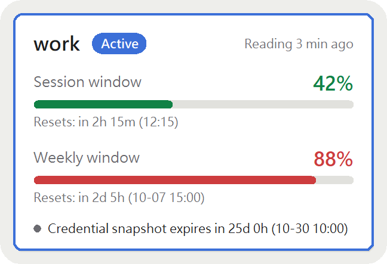
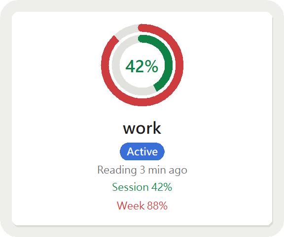
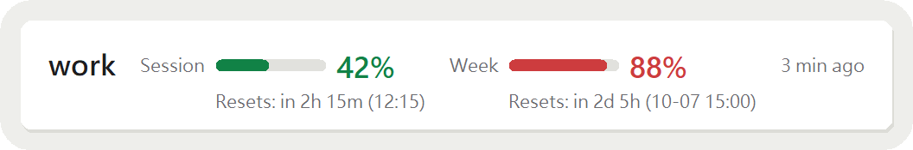

# cc-quota-tracker

English | [正體中文](README.zh-TW.md)

A small always-on-top desktop window (Windows) that shows how much quota each of your Claude accounts has left, all at once. Claude Code only shows the account you are logged into; this tool keeps the last reading of every other account you have set up, so you can see which one has room this week.

Deployed from source: needs Python 3.9 or later, no installer.

Unofficial; not affiliated with or endorsed by Anthropic. Use at your own risk — see [Disclaimer](#disclaimer).

<p align="center">
  
  
</p>
<p align="center">
  
</p>

*The three layouts in compact mode, drawn with example data: card list, ring gauge, one-line strip.*

- **Compact mode**: the active account's session window and weekly window — progress bar and reading age; the reset countdown and credential expiry countdown depend on the layout (the card list shows both, the one-line strip shows the reset countdown, the ring gauge shows neither until expanded).
- **Expanded mode**: one card per watched account, the active one highlighted; standby accounts show their last observed reading and how old it is.
- **Query usage** (on request): when the active account's reading has fallen behind, one click asks Claude Code to look up the latest usage. See [Query usage](#query-usage).
- **Switch account**: change to another managed account from the right-click menu or the command line, without logging in again in Claude Code; a wrong switch can be undone with *Restore previous switch*. See [Switching accounts](#switching-accounts).
- Three layouts (card list, dense table / one-line strip, ring gauge), light / dark / follow-system theme, adjustable opacity, Traditional Chinese or English interface.

**Everything comes from local files that Claude Code already maintains. By default the tool sends no requests and never changes Claude Code's settings (no statusLine, no hooks). Only when you press the button, or turn on auto-query, does it ask Claude Code to look the usage up on its behalf. The tool writes to Claude Code's files only when you switch accounts, and then only the current credential and the one account-info key in Claude Code's settings file; see [Switching accounts](#switching-accounts).**

## Requirements

- Windows 10 or later
- Python 3.9 or later with `tkinter` (the standard python.org installer includes it). Standard library only — nothing to `pip install`.
- Claude Code, logged in at least once

## Intended setup and known limitations

The tool was designed and tested for one setup: **Windows, Claude Code on a subscription plan, conversations mostly in the Claude Code panel of VS Code, several accounts used in turn on the same computer.** Other setups — using only the terminal, several computers, one account shared by several people — have not been tested. They may work partly, or not at all.

Known limitations:

- Querying, and the live judgement of whether a reading is lagging, work for the **active account only**. A standby account shows its last observed reading (flagged *Lagging before the switch* if it already was when you switched away).
- Quota used on another device, or on the claude.ai website, leaves no conversation record on this computer. A lagging reading cannot be detected there, and auto-query will not be triggered by it. Use right-click → *Query usage* when you know that happened.
- The *Update* button on the card appears only while the reading is lagging or pending. At other times use the right-click menu.
- The tool depends on things Claude Code does not document: the `cachedUsageUtilization` field (see [For hosts](#for-hosts-what-the-tool-depends-on)) and the experimental interface that Query usage uses. A Claude Code update can break either. If the interface changes, Query usage fails with a reason, everything else keeps working from the cache, and `/usage` in Claude Code remains the fallback.

## Setup in three steps

1. **Put the code somewhere.** Clone this repository (or just copy the folder) to anywhere you like, then open a terminal in it. All commands below are run from that folder.

   ```
   git clone https://github.com/dummylaze/cc-quota-tracker.git
   cd cc-quota-tracker
   ```

2. **Manage your accounts.** For each account: log in with Claude Code, then run

   ```
   python -m cc_quota_tracker add <label>
   ```

   See [Managing accounts](#managing-accounts).
3. **Start it.**

   ```
   pythonw -m cc_quota_tracker gui
   ```

   `pythonw` starts it without a console window. (`python -m cc_quota_tracker gui` works too, but keeps a console open.)

To have the window start when you log into Windows, use *Start at login* in the right-click menu (see [Window and menu](#window-and-menu)).

## Managing accounts

A watched account is one that has a **credential snapshot** in the managed directory: a copy of its login credential that this tool keeps. The snapshots live in the managed directory (`~/.claude-multi/` by default), one file per account; the file name without `.json` is the **account label** shown on screen.

Watched accounts come in two kinds: a **managed account** can be switched to; a **watch-only account** can only be watched, not switched to (see [Managed and watch-only accounts](#managed-and-watch-only-accounts)).

> The label is the only account name the tool ever displays. It never shows your email address. (When you manage an account, it keeps a copy of Claude Code's account info, which includes the email, next to the credential snapshot with the same restricted permissions. It is stored only, never displayed or sent anywhere.) If you pick a label that looks like an email, the tool warns you, because it will appear on screen (and in screenshots).

There are three ways in:

### 1. Command line

Log in to the account in Claude Code first, then:

```
python -m cc_quota_tracker add <label>
```

This copies the current credential into the managed directory together with Claude Code's account info, and binds it to the account currently logged in, so the account is recognised immediately and can be switched to later. Running `add` again with an existing label overwrites it — this is how you manage again a credential snapshot that has expired or become invalid, or an account managed by an earlier version.

Other commands:

```
python -m cc_quota_tracker remove <label>   # remove a watched account (its leftover data too)
python -m cc_quota_tracker list             # print the same information as the window, as text; a watch-only account gets its reason and the remedy command
python -m cc_quota_tracker query            # ask Claude Code for the latest usage (see "Query usage")
python -m cc_quota_tracker switch <label>   # switch to this managed account (see "Switching accounts")
python -m cc_quota_tracker switch --previous   # restore the previous switch (see "Switching accounts")
python -m cc_quota_tracker check            # see "For hosts" below
python -m cc_quota_tracker gui              # open the window
python -m cc_quota_tracker --help           # print all commands
```

### 2. Right-click menu

Right-click the window:

- **Add the currently logged-in account…** asks for a label and does the same as `add`.
- **Import a credential file…** picks a credential file and copies it into the managed directory; the label defaults to the file name without `.json`.

### 3. Drop a file in

Copy a credential file into the managed directory yourself (right-click → *Open folder* → *Managed directory* gets you there), named `<label>.json`. Renaming a file renames the account label; the identity binding is kept.

**Limitation of dropping a file in (and of *Import*):** the file carries no account identifier and no account info, so the tool cannot tell which account's readings belong to it, and cannot switch to it: it is a watch-only account, with the reason "no account info". Until that account has been your active account once and Claude Code has written a reading for it, its card shows **Reading pending** and nothing else. With `add` none of this happens, because it binds the account at the moment you run it and saves the account info too.

### Managed and watch-only accounts

- **Managed account**: a watched account that can be switched to. Its credential snapshot was created by `add` (or right-click → *Manage the signed-in account…*), has account info, has not expired, is not invalid, and has no write-back failure.
- **Watch-only account**: every other watched account. Its card still shows the reading and the expiry countdown; it just cannot be switched to. The card carries a one-line reason, and in the *Switch account* submenu it cannot be selected.

The reasons:

| Reason | What it means |
|---|---|
| **No account info** | The snapshot came from an earlier version, was imported, or was dropped into the managed directory, so no account info was saved when it was managed. |
| **Expired** | The refresh token in the snapshot is past its expiry time. One that is close to expiring but not yet expired is still a managed account; the confirmation dialog's countdown warns you. |
| **No longer valid** | This snapshot is not from the same login as the credential Claude Code uses now — for example you logged in again to the same account. The mark stays until you manage the account again, even after you switch to another account. See [Credential sync](#credential-sync). |
| **Write-back failed (retrying n/3) / (stopped retrying)** | The tool failed to write a refreshed credential back to the snapshot. While it is retrying it recovers by itself and you need do nothing; once it has stopped retrying, manage the account again. See [Credential sync](#credential-sync). |

When several reasons apply, the card shows one, in this order: expired, no longer valid, write-back failed, no account info.

**Whatever the reason, the remedy is the same: sign in to that account in Claude Code, then manage it again** — run `add <label>` with the same label, or right-click the window and choose *Manage the signed-in account…*. (Except while a write-back is still retrying: that recovers by itself.) `list` prints each watch-only account's reason and this remedy command.

### Permissions

The managed directory holds long-lived credentials for every account. `add` and *Import* restrict it to your Windows user only (inheritance removed) and check the result afterwards; if the permissions were not as expected, the tool fixes them and tells you. Credential snapshots, account info, the pre-switch credential (see [Switching accounts](#switching-accounts)) and snapshots after a write-back all carry the same restricted permissions as when they were managed. They are **not encrypted** — the protection is the file permissions, so treat the directory like `~/.claude` itself.

Some locations cannot restrict permissions at all — FAT32 and exFAT drives, common on USB sticks. If the managed directory is on one, the tool keeps working as usual and keeps warning you: a banner on the board, and a warning from `add` and *Import*. To silence the board banner, right-click → *Stop warning about unrestricted permissions*; it comes back if you switch to another managed directory, or if the permissions are once restricted successfully and later can't be again. The `add` and *Import* warnings are not affected. If you see the warning while the directory is already on NTFS, check that you are the owner of the directory.

## Switching accounts

Only managed accounts can be switched to (see [Managed and watch-only accounts](#managed-and-watch-only-accounts)). A switch writes the target account's credential snapshot as the **current credential**, and in Claude Code's settings file (`.claude.json`) rewrites only the account-info key (`oauthAccount`); everything else in it is left byte for byte. A Claude Code session you open afterwards uses the new account; whether a session that is already open follows is up to Claude Code and not something this tool controls. The tool does not change Claude Code's settings, register a statusLine or hooks, or make any network request.

### Switching from the window

1. Right-click the window and choose **Switch account**; the submenu lists the standby accounts, by account label. It is the same in all three layouts; there is deliberately no switch button on the cards, so you cannot hit one by accident.
   - A watch-only account is greyed out and cannot be selected; its card says why.
   - When there is no account to switch to, the submenu holds one greyed row, *(No account to switch to)*.
   - While a usage query is running (manual or automatic) the whole submenu is greyed out until it finishes.
2. After you pick one, a **confirmation dialog** shows which label you are switching to, the expiry countdown of its snapshot, and what the switch will do:
   - if the active account is a watched account, its credential is synced back to its snapshot first;
   - if the active account is an unwatched account, its credential is only saved as the pre-switch credential, and only the latest copy is kept.

   When the active account's snapshot is invalid there is one more line: "The active account's snapshot is invalid; use "Restore previous switch", or sign in again in Claude Code and then re-manage it." The dialog shows no usage numbers and has no countdown delay; confirming starts the switch at once.
3. After you confirm, a translucent layer covers the whole window until the switch has finished or clearly failed. While it is up the right-click menu does not open, you can still drag the window, and **a switch cannot be cancelled once started**. In expanded mode the layer shows the current step: syncing the current credential, querying usage for the old account (skipped when the old account's reading is not lagging or it is not bound), writing the target's credential, querying usage for the new account. Compact mode shows no steps.

**Outcomes**

- **Success**: no message. The first row changing to the new account and the reading updating is the feedback.
- **Refused**: the reason is shown, no file was written, and the current credential and account info are unchanged. A switch is refused when: the label does not exist; the target is a watch-only account (including an expired one); the target is already the active account; the active account's credential could not be synced back to its snapshot before switching away; the current credential or Claude Code's settings file could not be read; the current credential or the pre-switch credential could not be written.
- **Written, but verification failed**: the switch was written, but the usage query for the new account failed, so it could not be confirmed. A prompt asks "Restore the previous switch?"; *Yes* goes straight back to the original account (no further confirmation), *No* stays on the new one. (When a restore itself fails verification, the window only explains and does not ask whether to restore.)
- **The query for the old account failed**: no message; the switch goes ahead.
- **Account info not written**: the current credential was written but Claude Code's account info could not be, so the two disagree. The window shows an error; sign in again in Claude Code.

Around a switch the tool queries usage once for the old account and once for the new one (still by asking Claude Code): the first makes the reading left behind on the standby account fresh, the second makes the new account's reading appear at once and confirms the switch took effect. These two queries do not start the *Update* button's cooldown, but they count toward the auto-query interval, so the total number of queries is never more than your own actions would cause. Every switch appends an entry to the switch log (see [For hosts](#for-hosts-what-the-tool-depends-on)).

### Restoring the previous switch

Before every switch the tool saves the current credential together with the account info as the **pre-switch credential**, in the managed directory (restricted permissions). **Only the latest one is kept**, and every switch overwrites it; it is not a credential snapshot, produces no card and does not make any account a watched account. If you were logged into an unwatched account before the switch, that is fine: after switching away you can still get back to it with the restore, without logging in again.

- **Window**: the last row of the *Switch account* submenu is **Restore previous switch** (below a separator). It is greyed out when there is no pre-switch credential, when it has expired, or when the account info saved with it is empty. Choosing it first shows a confirmation dialog like any switch (with what will happen and the pre-switch credential's expiry countdown), and the layer covers the window the same way. The grey-out only reflects whether the pre-switch credential is usable; other refusals (for example the current credential cannot be read) are shown with their reason after you click.
- **Command line**: `switch --previous`, see the next section.
- **A restore is itself a switch**: it saves the credential in use at that moment as the new pre-switch credential, so restoring once more takes you back to the account you just left.
- The pre-switch credential has an expiry date like a snapshot, and once expired it cannot be restored; to get back to that account, sign in to it again in Claude Code.

### Switching from the command line

```
python -m cc_quota_tracker switch <label>
python -m cc_quota_tracker switch --previous
```

Both accept `--yes` (before or after the label).

- **In a terminal, without `--yes`**: it prints the same content as the confirmation dialog (target label, snapshot expiry countdown, what will happen; no usage numbers) and asks `Continue? [y/N]`. Only `y` or `yes` (any case) switches; just pressing Enter, typing anything else, EOF or Ctrl-C all count as no and print "Cancelled; nothing was switched." A request that would be refused even if confirmed (unknown label, a watch-only target, …) is refused before any question is asked.
- **With `--yes`**: it skips the confirmation and switches straight away, so you can call it from your own scripts. That is all `--yes` is for; the tool has no automatic switching triggered by quota level.
- **Not in a terminal and without `--yes`**: it prints the usage text to stderr and writes nothing.

Exit codes:

| Code | Meaning |
|---|---|
| `0` | Success |
| `1` | Refused, or you answered no at the confirmation; nothing was written, the current credential and account info are unchanged |
| `2` | Usage error, or no `--yes` and not in a terminal (cannot confirm); nothing was written |
| `3` | Written, but verification failed (the usage query for the new account failed), or only half written (the current credential was written, the account info was not) |

When `switch <label>` fails verification, the message includes the command to go back: `switch --previous --yes`; when `switch --previous` itself fails verification it only says the restore could not be confirmed, without a command (restoring again would just loop back to the account you left). `python -m cc_quota_tracker --help` lists both forms and `--yes` too.

**Note:** if you switch from the command line while the board is open, both keep working; the tool does not check Claude Code's refresh lock file, and there is no lock between the window and the command line, so when both act at once the later write wins.

## Credential sync

**Why it is needed.** Each time Claude Code refreshes the current credential it swaps in a new refresh token and the old one stops working at once. So a credential snapshot becomes a dead file as soon as its account has been the active account and been refreshed once — earlier versions left the "invalid" warning lit permanently and still showed a valid expiry countdown on the standby account.

**What it does.** After the current credential is refreshed, the tool writes the new credential back to the credential snapshot **from the same login**, so a refresh neither kills the snapshot nor marks it "no longer valid".

- **How "the same login" is decided**: by the refresh token's expiry time only. If the current credential's expiry time is within 60 seconds of a snapshot's, and exactly one snapshot matches, that is taken as the same login and the current credential is written back to it. If two or more match, **none is written** — better not to write than to write to the wrong account. The tool never guesses whom the current credential belongs to from the account identifier and rewrites a snapshot on that basis.
- **When it syncs**: only while the board is open, once per refresh round (about every 5 seconds, the poll). A refresh that happened while the board was closed is caught up in the first poll after the next start; no need to manage again. On the command line only `switch` syncs, once, before writing; `list`, `query`, `add` and `remove` do not sync (`add` overwriting an existing label is managing it again, not a sync).
- **The written file**: an atomic write, with the same restricted permissions as when it was managed.
- **Switching with another tool or `/login`**: the tool still detects it as a switch. The account you switched away from keeps a usable snapshot, as long as the board synced its latest credential while it was still the active account.
- **When the write-back fails**: the account is temporarily watch-only and its card says "Couldn't write back the credential snapshot, retrying automatically n/3". It retries once per poll; on success it becomes a managed account again by itself and you need do nothing. After three failures it stops retrying and the card asks you to manage the account again. The retry count survives a restart; the next time Claude Code refreshes, the count starts over, giving the new credential a fresh chance. A failed write-back opens no dialog and does not affect the rest of the board.
- **"No longer valid"** now lights only when no evidence of the same login can be found — for example you logged in again to the same account, and the new login is not the one the snapshot came from. It means "this snapshot can no longer be used", not "Claude Code rotated the credential"; differences caused by a refresh are filled in by the sync and are not invalidity. Once set, the mark stays until you manage the account again, even if you switch to another account; managing it again clears it and the account is a managed account again.

## Upgrading from an earlier version

Credential snapshots managed by an earlier version carry no account info, so after the upgrade those accounts are **watch-only accounts** with the reason "no account info". Their readings and expiry countdowns still show; they just cannot be switched to. **For each account you want to switch to, do this once:**

1. Log in to that account in Claude Code.
2. Manage it again: right-click the window → *Manage the signed-in account…* with the same label, or run `python -m cc_quota_tracker add <label>`.

Managing it again overwrites the snapshot and saves the account info; from then on it is a managed account. Accounts you do not plan to switch to can stay watch-only; nothing needs doing. Your other data — settings file, account bindings, switch log — carries over as is. What the screen used to call an "unmanaged account" is now an **unwatched account**: an account the tool is not watching at all.

## Two states that are not faults

| What you see | What it means |
|---|---|
| **Reading pending** (讀數待更新) | The active account has no reading of its own yet. Claude Code keeps only one account's reading at a time, so right after a switch the cached reading still belongs to the previous account, and the tool will not show it under the new one. It appears once Claude Code updates its cache (usually within seconds of logging in; otherwise on the next prompt or when its usage panel is open), or as soon as you press **Update** (see [Query usage](#query-usage)). |
| **Unwatched account** (未監看帳號) | The account you are logged into has no credential snapshot here. The card tells you how to manage it. Nothing is wrong. When you switch away from it, its credential is saved as the pre-switch credential, so you can still come back with *Restore previous switch* (see [Switching accounts](#switching-accounts)). |

Standby accounts show their **last observed** reading and how long ago that was (e.g. 3 天前). That reading is only accurate if the account has not been used since it was observed — if you used it on another machine, this machine cannot see that. Standby readings are never flagged as out of date just for being old. For the active account, an old reading is not flagged either unless there has been new conversation activity on this machine since the reading ("New activity; usage not updated"). If a reading was already flagged that way when you switched away from the account, its standby card keeps saying **Lagging before the switch** until a new reading for that account appears.

## Query usage

Every number comes from Claude Code's usage cache, and Claude Code only updates it at certain moments (when you run `/usage`, when you log in, …). While you keep chatting, the active account's reading falls behind — an hour or more is common — and the card says "New activity; usage not updated". **Query usage** asks Claude Code to look up the active account's latest usage and write it back to its cache; the tool then reads the cache as usual. The tool itself sends no request, never touches your token, and does not use the response to the query as a data source: success is judged only by whether the cache moved forward.

**Ways to start one**

- **The *Update* button** on the active account's card, next to the "New activity; usage not updated" or "Reading pending" note, in all three layouts. It appears only then. While the query runs it reads "Updating…", and for 30 seconds after a manual query (successful or not) it cannot be clicked, so you cannot hammer it. The right-click menu item shares that cooldown.
- **Right-click → Query usage**, any time except while a query is running or cooling down — for example when the reading is not flagged but you know you used the account somewhere else.
- **Command line**: `python -m cc_quota_tracker query` runs one query and waits for it. On success it prints the new observation time and exits with 0; on failure it prints the reason and exits with 1, so a script can tell. It has no cooldown (it is a separate process from the window). When a reading is lagging or pending, `list` also prints a line pointing to `query` and to `/usage`.
- **Auto-query**, off by default. Turn it on with right-click → *Auto-query usage* (kept after a restart). While on, the tool queries only when the active account's reading is lagging or pending, and never twice within one interval (`providers.claude.autoUsageQueryMinutes`, default 15 minutes, minimum 5). The interval counts from the later of the tool's last query and the reading's observation time, so a `/usage` you ran yourself counts as one. When you walk away and no new conversation appears, the reading stops being lagging, so auto-query makes at most one more query and then stops by itself; if a long task, a background sub-agent or a schedule is still running, it keeps going at the interval, because quota really is being used. After 3 failed auto-queries in a row it pauses, and the card shows "Auto-query paused" with the last reason; one successful manual update resumes it. After a single failure it waits a full interval before trying again. The pause state is kept in memory only, so restarting the tool starts it afresh.

**What it does.** The tool starts `claude` as a child process in print mode and sends the same request that Claude Code's own usage panel sends. The child always runs with `--settings '{"disableAllHooks":true}'`, so none of your Claude Code hooks (sounds, backups, reminders) fire. It runs no model, creates no conversation record and changes none of Claude Code's settings files. It usually takes a few seconds; the tool gives up after 20 seconds. It counts as successful only if the cache's observation time moved forward. If you relocated the Claude Code directory (see [Where the tool looks for files](#where-the-tool-looks-for-files)), the child is pointed at the same directory, so what it updates is the cache the tool is reading. No console window opens and focus is not taken.

**Cost and risk.** The request goes to the same endpoint as `/usage`, and counts against your account like any other request. Asking too often can get you rate-limited, and **while you are rate-limited even your own `/usage` fails**. That is why auto-query is off by default, has a minimum interval and pauses after repeated failures. The 5-minute minimum is a cautious guess: the provider does not publish a limit for this endpoint. Manual queries are only held back by the 30-second cooldown, so use them with the same care.

**When it fails**, the card shows a short reason next to the Update button and suggests running `/usage` in Claude Code instead. The reading you had stays exactly as it was. There are four kinds of reason:

- the `claude` executable was not found;
- the query timed out;
- Claude Code reported an error — its own message is shown untranslated (for example that you are not logged in); on the card, line breaks are collapsed and a long message is cut off at 60 characters;
- Claude Code finished but did not update the usage cache.

**Finding `claude`.** The tool looks for `claude` on `PATH`. If it is somewhere else, put its full path in `providers.claude.claudeCommand` in the settings file; that takes effect without a restart. A filled-in path that is not absolute or does not point to an existing file makes the query fail — the tool does **not** fall back to `PATH`, because that would silently run a different `claude` than the one you chose. (Unlike the path fields below, a bad `claudeCommand` does not stop the tool; only the query fails.) As with `CLAUDE_CONFIG_DIR`, a tool started at login only sees *user-level* `PATH` entries; if Update says it cannot find `claude` although it works in your terminal, set `claudeCommand`.

## Credentials expire

A credential snapshot's refresh token lives about 30 days, and a refresh does not extend it. Each card shows the time left; when less than `expiryWarningDays` (default 7) remain, it warns you, but the account can still be switched to. Once it has expired the account is a watch-only account (reason "expired") and can no longer be switched to. To renew: log in to that account again in Claude Code, then either right-click the window and choose *Manage the signed-in account…* with the same label, or run `add <label>` again.

A card that says "no longer valid" is not about age: it means the snapshot is not from the same login as the credential Claude Code uses now (for example you logged in again to the same account); manage it again the same way to recover. A refresh by Claude Code does not make a snapshot invalid, because the tool writes the new credential back to it; see [Credential sync](#credential-sync). Apart from that sync, and from managing an account again, the tool never rewrites a credential snapshot.

## Window and menu

Drag anywhere to move; double-click to switch between compact and expanded. Right-click for:

- **Layout**: card list (default) / dense table and one-line strip / ring gauge
- **Query usage** and **Auto-query usage** (default off): see [Query usage](#query-usage)
- **Switch account**: a submenu listing the standby accounts, with *Restore previous switch* as its last row: see [Switching accounts](#switching-accounts)
- **Always on top** (default on), **Mode** (compact / expanded)
- **Language**: follow system (default), 正體中文, English. Follow system uses the Windows display language and falls back to English when it is neither Traditional Chinese nor English. Switching takes effect at once; the command line (`list`, `add`, `check`, …) follows the same setting. Values Claude reports itself (a lock reason, the name of a limit this tool doesn't recognise) are shown as reported, not translated
- **Theme**: follow system (default), light, dark
- **Opacity**: 100% (default), 85%, 70%
- **Start at login** (default off): writes one value to your user's `Run` registry key and removes it when turned off. It does not need administrator rights and touches nothing else. The checkbox always reflects the actual registry value. The registered command points at the Python and the folder it was turned on from; if you move the folder or change Python, the checkbox shows off until you turn it on again.
- **Add / Import / Open folder / Quit**: *Open folder* has two entries, *Managed directory* and *Settings directory*

The window remembers its position; if that position is no longer on any screen (for example an unplugged monitor) it moves back to the primary screen.

## Error log

Started with `pythonw`, the tool has no console, so an error leaves no trace on screen. Whenever a round does not complete, the error (time and full traceback) is appended to `%APPDATA%\cc-quota-tracker\errors.log`, next to `settings.json` and deliberately not in the managed directory, since the managed directory may be what is failing. To open it, right-click → *Open folder* → *Settings directory*.

An entry is written when a round fails after a completed one, or when the error changes while rounds keep failing; the same error repeating is written once. Past 1 MB the file is renamed to `errors.log.1` (replacing the previous one) and a new `errors.log` starts, so at most about 2 MB are kept. If the log itself cannot be written, the tool carries on without it and without any dialog.

## Settings file

Location: `%APPDATA%\cc-quota-tracker\settings.json`. It is written with every field at its default the first time the tool starts, and never replaced afterwards (changing a setting from the right-click menu updates only that one field). It is deliberately **not** inside the managed directory, because the managed directory's location is itself a setting.

You can edit it with a text editor. Settings are re-read every 5 seconds and take effect without a restart; the two path fields are read only at startup (the window tells you when a restart is needed).

| Field | Values | Default | Meaning |
|---|---|---|---|
| `layout` | `"cards"`, `"table"`, `"ring"` | `"cards"` | Card list / dense table and one-line strip / ring gauge |
| `alwaysOnTop` | `true`, `false` | `true` | Keep the window above others |
| `mode` | `"compact"`, `"expanded"` | `"compact"` | Active account only / all accounts |
| `language` | `"system"`, `"zh-TW"`, `"en"` | `"system"` | Interface language, for the window and the command line. `system` follows the Windows display language: Traditional Chinese (zh-TW, zh-HK, zh-MO) gives `zh-TW`, English gives `en`, anything else falls back to `en` |
| `theme` | `"system"`, `"light"`, `"dark"` | `"system"` | `system` follows the Windows app light/dark setting |
| `opacity` | `100`, `85`, `70` | `100` | Window opacity in percent |
| `countdownFormat` | `"twoUnits"`, `"decimalDays"` | `"twoUnits"` | `twoUnits`: 6d 23h / 2h 15m / 40m (days + hours, hours + minutes, minutes; the Traditional Chinese interface writes 6天23小時 / 2小時15分 / 40分). `decimalDays`: 6.9d (6.9天) when a day or more remains (shorter spans still show hours and minutes). Both truncate, never round up |
| `font` | font family name or `null` | `null` | Font for all text. `null` uses the built-in fonts (Microsoft JhengHei UI, and Segoe UI Semibold for the big percentages). Sizes and weights stay as designed. A font that is not installed on this computer is replaced by the system default font, and for a name you typed the window says so. Settings file only, not in the right-click menu |
| `providers.claude.expiryWarningDays` | positive integer | `7` | Warn when the credential snapshot has *less than* this many days left |
| `providers.claude.warningPercent` | integer 1–100, less than `criticalPercent` | `60` | Yellow threshold, used only when Claude does not report a severity itself |
| `providers.claude.criticalPercent` | integer 1–100, greater than `warningPercent` | `85` | Red threshold, same condition |
| `providers.claude.claudeCommand` | absolute path to the `claude` executable, or `null` | `null` | Which `claude` [Query usage](#query-usage) starts. `null` searches `PATH`. A filled-in path that is not absolute or not an existing file makes the query fail (no fallback to `PATH`). Takes effect without a restart |
| `providers.claude.autoUsageQuery` | `true`, `false` | `false` | Auto-query on or off. Also switched by right-click → *Auto-query usage*, which rewrites only this field |
| `providers.claude.autoUsageQueryMinutes` | positive integer | `15` | Minimum minutes between auto-queries. **Lower limit 5**: a smaller value runs as 5, the window says so (while auto-query is on), and the file is not rewritten. Manual queries are not affected |
| `claudeConfigDir` | absolute path or `null` | `null` | Where Claude Code keeps its files (see below) |
| `managedDir` | absolute path or `null` | `null` | Where credential snapshots are kept (see below) |

The window position is remembered separately and is not in this file.

**A bad value** falls back to the default for that one field only (the two percentage thresholds fall back together unless `warningPercent` is less than `criticalPercent`). The window names the invalid field (a bad value under `providers` is named by its path, e.g. `providers.claude.warningPercent`; when the two thresholds are not in increasing order, both are named, even the one you did not write). If the whole file is not valid JSON, every default is used, the window says so, and the tool will not overwrite the file until you fix it (changes made from the right-click menu then last only until you quit).

Progress bar colours follow the severity Claude itself reports (`normal` / `warning` / `critical`); the percentage thresholds above are only a fallback when it reports none.

### Where the tool looks for files

**Claude Code directory** (where the usage cache and the current credential live) — the first one that is set wins:

1. `claudeConfigDir` in the settings file
2. the `CLAUDE_CONFIG_DIR` environment variable (empty counts as unset)
3. the default: `~/.claude.json` and `~/.claude/`

With 1 or 2, both `.claude.json` and `.credentials.json` are looked for **inside** that directory, not next to it. (This is different from the default, where `.claude.json` sits in your home directory and the credential in `~/.claude/`.)

**Managed directory**: `managedDir` in the settings file, otherwise `~/.claude-multi/`. It may be on another drive. It must not be inside the Claude Code directory, because the tool writes there only the current credential and the account info when you switch, and nothing else.

A path field that is filled in must be an **absolute path to an existing directory**. If it is not, the tool **stops with an error naming the field** rather than falling back — falling back would silently read a different set of accounts while everything looked normal. Relative paths are rejected because they would resolve against a different working directory when started at login.

> **Start at login and `CLAUDE_CONFIG_DIR`:** a program started at login only inherits *user-level* Windows environment variables. If you set `CLAUDE_CONFIG_DIR` only in a shell profile, the tool started at login will not see it and will read the default location instead. Put the directory in `claudeConfigDir` in the settings file (or set the variable at user level in Windows).

If none of the three levels is set and `~/.claude.json` cannot be found, the window shows a "may be reading the wrong location" notice instead of quietly showing "no reading".

## For hosts: what the tool depends on

All usage numbers come from the `cachedUsageUtilization` field in Claude Code's `.claude.json`. **This is an internal, undocumented field. Claude Code makes no compatibility promise about it, and a Claude Code update can change or remove it.** Switching accounts also depends on two more things: `oauthAccount` (the account info) in `.claude.json` and `.credentials.json` (the current credential); the same lack of compatibility promise applies, and `check` verifies the former.

The tool tolerates the expected kinds of trouble: a file caught mid-write (it keeps the last value quietly), a missing field (shown as "no reading yet", not an error), and unknown limit types (shown under their original names as "other limits"). If the structure genuinely changes, a banner appears — only after the problem persists for 3 consecutive polls — together with the last successful reading and its time, instead of a wall of 0%. A different banner, "Board stopped updating", means the tool itself could not finish a poll for about a minute (12 polls in a row): the board stays on the last successful reading, shown with its time, and the banner clears as soon as a poll succeeds again.

To check compatibility at any time:

```
python -m cc_quota_tracker check
```

It verifies that every field path the tool relies on still exists with the expected type, lists new unknown fields under `utilization`, and prints the Claude Code directory and managed directory actually in use, saying whether each came from the settings file, the environment variable, or the default. It prints field names and types only, never values.

The tool also appends a log of every account switch — whether it made the switch itself or observed one made by another tool or `/login` (time and account identifier only, kept in the managed directory with restricted permissions and never shown on screen) — and the time it last ran, so that future reporting can attribute usage to the right account.

## Out of scope for this version

Encrypting credential snapshots, a restore history deeper than one step, token reports, other providers, macOS / Linux, packaging as an exe, network requests made by the tool itself (Query usage goes through Claude Code), querying standby accounts, and any automation triggered by quota level.

## Disclaimer

cc-quota-tracker is an independent, unofficial tool. It is not affiliated with, endorsed by or supported by Anthropic. "Claude" and "Claude Code" are trademarks of Anthropic, PBC, used here only to describe what the tool works with.

**Use it at your own risk.** You are responsible for making sure that how you use your accounts complies with Anthropic's terms of service and usage policies. The authors accept no responsibility for rate limiting, account restrictions or suspensions, lost or invalidated credentials, or any other consequence of using this tool.

In particular:

- The tool reads files that Claude Code keeps on your computer, including credentials, and keeps copies of them (credential snapshots) unencrypted in the managed directory. When you switch accounts it rewrites Claude Code's current credential and account info; if that rewrite goes wrong, Claude Code may need you to sign in again. The tool itself makes no network requests and has no server: your credentials and readings stay on your computer and are never sent to the authors or anyone else. (Query usage is the one exception that reaches the network, and it does so through Claude Code; see below.) Protecting the managed directory is up to you; see [Permissions](#permissions).
- Query usage asks Claude Code to send a request to the same endpoint as `/usage`. Asking too often can get you rate-limited; see [Query usage](#query-usage).
- The tool depends on parts of Claude Code that are not documented and can change at any time; see [For hosts](#for-hosts-what-the-tool-depends-on). A reading shown by the tool may be out of date or wrong. Check `/usage` in Claude Code before relying on it.

The software is provided "as is", without warranty of any kind; see [LICENSE](LICENSE).

## License

MIT; see [LICENSE](LICENSE).
