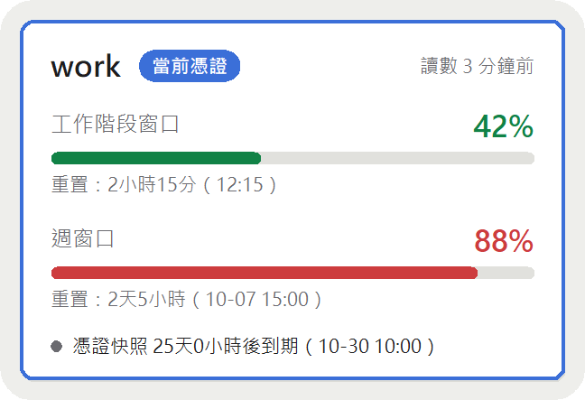

# cc-quota-tracker

[English](README.md) | 正體中文

一個 Windows 桌面懸浮小視窗，一眼看到你每個 Claude 帳號各自還剩多少額度。Claude Code 只顯示目前登入的帳號；本工具會替你納管的每個帳號保留最後一次的讀數，讓你知道這週哪個帳號還有餘裕。

以原始碼部署：需要 Python 3.9 以上，沒有安裝檔。

非官方工具，與 Anthropic 無關。使用風險自負，見[免責聲明](#免責聲明)。

<p align="center">
  
  
</p>
<p align="center">
  
</p>

*三種版面的精簡模式，用範例資料畫出：卡片列表、環形儀表、單行條。*

- **精簡模式**：只顯示當前憑證帳號的工作階段窗口與週窗口——進度條與讀數年齡；重置倒數與憑證到期倒數依版面而定（卡片列表兩者都有，單行條有重置倒數，環形儀表精簡模式都沒有、展開才有重置倒數）。
- **展開模式**：每個監看帳號一張卡片，當前憑證帳號高亮；待命帳號顯示最後一次觀測到的讀數和它的相對年齡。
- **查詢額度**（按需使用）：當前憑證帳號的讀數落後時，按一下就請 Claude Code 去查最新的額度。見〈查詢額度〉。
- **切換帳號**：從右鍵選單或命令列換到另一個納管帳號，不必回 Claude Code 重新登入；切錯了可以還原上一次切換。見〈切換帳號〉。
- 三種版面（卡片列表、密集表格／單行條、環形儀表）、淺色／深色／跟隨系統主題、可調透明度、正體中文或英文介面。

**所有數字都來自 Claude Code 自己維護的本機檔案。預設不發任何請求、不修改 Claude Code 的設定（不掛 statusLine，不掛 hooks）；只有你按下按鈕或開啟自動查詢時，才會請 Claude Code 代查。工具只在你切換帳號時寫入 Claude Code 的檔案，而且只寫當前憑證，以及設定檔裡帳號資訊那一個鍵，見〈切換帳號〉。**

## 環境需求

- Windows 10 以上
- Python 3.9 以上，且含 `tkinter`（python.org 的標準安裝程式就有）。只用標準庫，不需要 `pip install` 任何東西。
- Claude Code，且至少登入過一次

## 適用情境與已知限制

本工具是依一種特定的使用情境設計與測試的：**Windows、Claude Code（訂閱方案）、對話主要在 VS Code 的 Claude Code 面板中進行、同一台電腦輪流使用多個帳號。** 其他情境——只用終端機、多台電腦、多人共用一個帳號——都沒有測試過，可能部分可用，也可能完全不能用。

已知限制：

- 查詢額度，以及即時判斷讀數是否落後，都只對**當前憑證帳號**有效。待命帳號顯示最後一次觀測到的讀數（切走時若已經落後，會標示「切換前已落後」）。
- 在別的裝置或 claude.ai 網頁用掉的額度，不會在這台電腦留下對話紀錄，所以看不出讀數已經落後，也不會觸發自動查詢。知道發生過這種事時，請用右鍵 →「查詢額度」。
- 卡片上的「更新」按鈕只在讀數落後或待更新時出現，其他時候請用右鍵選單。
- 本工具依賴 Claude Code 沒有公開的東西：`cachedUsageUtilization` 欄位（見[〈給架設者：本工具依賴什麼〉](#給架設者本工具依賴什麼)）與查詢額度使用的實驗性介面。Claude Code 更新後，兩者都可能壞掉。介面改版時，查詢額度會失敗並顯示原因，其餘功能仍照額度快取運作，退路是在 Claude Code 執行 `/usage`。

## 部署三步

1. **放好程式。** 把這個 repo clone（或直接複製資料夾）到任一位置，再在那個資料夾裡開終端機。下面所有命令都在那個資料夾裡執行。

   ```
   git clone https://github.com/dummylaze/cc-quota-tracker.git
   cd cc-quota-tracker
   ```

2. **納管帳號。** 每個帳號都先在 Claude Code 登入，再執行

   ```
   python -m cc_quota_tracker add <帳號標籤>
   ```

   詳見〈納管帳號〉。
3. **啟動。**

   ```
   pythonw -m cc_quota_tracker gui
   ```

   用 `pythonw` 啟動就不會出現主控台視窗。（用 `python -m cc_quota_tracker gui` 也可以，但會多開一個主控台。）

想在登入 Windows 時自動出現視窗，用右鍵選單的「開機自動啟動」（見〈視窗與選單〉）。

## 納管帳號

監看帳號＝納管目錄裡有它的**憑證快照**（登入憑證的保管副本）的帳號。憑證快照放在納管目錄（預設 `~/.claude-multi/`），一個帳號一個檔案；檔名去掉 `.json` 就是畫面上顯示的**帳號標籤**。

監看帳號分兩類：**納管帳號**可以切換過去；**僅監看帳號**只能看，不能切換過去（見〈納管帳號與僅監看帳號〉）。

> 帳號標籤是畫面上唯一顯示的帳號名稱。本工具不顯示你的 email。（納管帳號時，會把 Claude Code 的帳號資訊——裡面含 email——跟憑證快照一起存在納管目錄，權限同樣收緊；只保存，不顯示、不外送。）如果標籤看起來像 email，工具會提醒你，因為它會顯示在畫面上（截圖時會洩漏）。

有三個入口：

### 1. 命令列

先在 Claude Code 登入該帳號，然後：

```
python -m cc_quota_tracker add <帳號標籤>
```

它會把當前憑證複製進納管目錄，連同 Claude Code 的帳號資訊一起存下，並和目前登入的帳號綁定，所以當下就認得出這是哪個帳號，也之後能切換過去。對已存在的標籤再執行一次 `add` 會覆寫——已過期或已失效的憑證快照，以及舊版納管的帳號，就是這樣重新納管。

其他命令：

```
python -m cc_quota_tracker remove <帳號標籤>   # 移除監看帳號（工具自己的殘留資料一併清掉）
python -m cc_quota_tracker list                # 用文字印出和視窗一樣的資訊；僅監看帳號會列出原因與補救指令
python -m cc_quota_tracker query               # 請 Claude Code 查詢最新額度（見〈查詢額度〉）
python -m cc_quota_tracker switch <帳號標籤>   # 切換到這個納管帳號（見〈切換帳號〉）
python -m cc_quota_tracker switch --previous   # 還原上一次切換（見〈切換帳號〉）
python -m cc_quota_tracker check               # 見〈給架設者〉
python -m cc_quota_tracker gui                 # 開啟視窗
python -m cc_quota_tracker --help              # 印出所有命令
```

### 2. 右鍵選單

在視窗上按右鍵：

- **納管目前登入的帳號…**：跳出標籤輸入框，做的事與 `add` 相同。
- **匯入憑證檔…**：選一個憑證檔複製進納管目錄，標籤預設取檔名去掉 `.json`。

### 3. 直接丟檔

自己把憑證檔複製進納管目錄（右鍵 →「開啟資料夾」→「納管目錄」就會開到那裡），檔名取 `<帳號標籤>.json`。直接改檔名就是改帳號標籤，身分綁定不會遺失。

**直接丟檔（以及「匯入憑證檔」）的限制：** 檔案本身不帶帳號識別碼，也沒有帳號資訊，所以工具無法判斷哪份讀數屬於它，也不能切換過去：它是僅監看帳號，原因是「沒有帳號資訊」。在那個帳號成為當前憑證帳號、且 Claude Code 為它寫入讀數之前，它的卡片只會顯示「**讀數待更新**」。用 `add` 就沒有這些問題，因為 `add` 在執行當下就完成綁定、也存下帳號資訊。

### 納管帳號與僅監看帳號

- **納管帳號**：可以切換過去的監看帳號。條件是它的憑證快照經 `add`（或右鍵「納管目前登入的帳號…」）建立、附有帳號資訊、沒有過期、沒有失效，也沒有寫回失敗。
- **僅監看帳號**：其他所有監看帳號。卡片照常顯示讀數與到期倒數，只是不能切換過去，卡片上會附一句原因，在「切換帳號」子選單裡也不能被選取。

原因有這幾種：

| 原因 | 意思 |
|---|---|
| **沒有帳號資訊** | 憑證快照是舊版納管的、匯入的，或直接放進納管目錄的，納管時沒有存下帳號資訊。 |
| **已過期** | 憑證快照裡的 refreshToken 已經過了到期時間。快到期但還沒過期的，仍是納管帳號，只是確認對話框的倒數會提醒你。 |
| **已失效** | 這份憑證快照跟 Claude Code 現在用的憑證不是出自同一次登入，例如你對同一個帳號重新登入過。失效的標記會一直保留到重新納管為止，即使換到別的帳號也不會消失。見〈憑證同步〉。 |
| **寫回失敗（重試中 n/3）／（已停止重試）** | 工具把刷新後的憑證寫回快照時失敗了。重試中會自己恢復，什麼都不必做；停止重試之後才需要重新納管。見〈憑證同步〉。 |

同時符合多個原因時，卡片只顯示一個，優先順序是：已過期、已失效、寫回失敗、沒有帳號資訊。

**不論原因是哪一種，補救方法都一樣：在 Claude Code 登入該帳號後重新納管**——執行 `add <帳號標籤>`（用同一個標籤），或在視窗按右鍵選「納管目前登入的帳號…」。（寫回失敗重試中除外：它自己會恢復。）命令列的 `list` 會為每個僅監看帳號印出原因與這條補救指令。

### 權限

納管目錄集中存放所有帳號的長效憑證。`add` 與「匯入憑證檔」會把它收緊到只有你這個 Windows 使用者能存取（移除繼承），並在事後檢查；權限不符預期時，工具會自動修正並告知。憑證快照、帳號資訊、切換前憑證（見〈切換帳號〉）與寫回後的憑證快照，權限都跟納管時一樣收緊。它們**沒有加密**——保護來自檔案權限，請把這個目錄當成 `~/.claude` 本身一樣看待。

有些位置根本無法收緊權限——FAT32、exFAT 磁碟，常見於隨身碟。納管目錄放在這類位置時，工具照常運作，並持續告警：看板上有橫幅，`add` 與「匯入憑證檔」也會告警。看板的橫幅可以從右鍵選單「不再提醒權限未收緊」關掉；換到別的納管目錄，或權限曾經收緊成功之後又收不緊時，會重新出現。`add` 與「匯入憑證檔」的告警不受影響。已經在 NTFS 上仍出現告警時，請確認這個目錄的擁有者是你。

## 切換帳號

只有納管帳號可以切換過去（見〈納管帳號與僅監看帳號〉）。切換會把目標帳號的憑證快照寫成**當前憑證**，並在 Claude Code 的設定檔（`.claude.json`）裡只改寫帳號資訊（`oauthAccount`）這一個鍵，其他內容逐字不動。之後新開的 Claude Code session 會使用新帳號；已經開著的 session 會不會跟著換，由 Claude Code 決定，不在本工具掌握之內。工具不修改 Claude Code 的設定、不掛 statusLine 或 hooks，也不發出任何網路請求。

### 從視窗切換

1. 在視窗上按右鍵，選「**切換帳號**」，子選單依序列出待命帳號（以帳號標籤顯示）。三種版面都一樣；卡片上沒有切換按鈕，避免誤點。
   - 僅監看帳號反灰、不能選，原因看它的卡片。
   - 沒有任何可切換的帳號時，子選單裡是一列反灰的「（沒有可切換的帳號）」。
   - 查詢額度進行中（手動或自動）時，子選單整個反灰，查完才能切換。
2. 點選之後跳出**確認對話框**：寫著要切換到哪個標籤、那份憑證快照的到期倒數，以及這次切換的後果——
   - 當前憑證帳號是監看帳號：它的憑證會先同步回它的快照；
   - 當前憑證帳號是未監看帳號：它的憑證只會存成切換前憑證，而且只留最新一份。

   當前憑證帳號的快照已失效時，多一行：「當前憑證帳號的快照已失效；用「還原上一次切換」，或在 Claude Code 重新登入後再重新納管。」確認對話框不顯示任何額度數字，也沒有倒數延遲，確認就立刻開始。
3. 確認之後，整個視窗蓋上一層半透明圖層，直到切換跑完或明確失敗為止。這段期間右鍵選單打不開，視窗仍可拖動，但**切換開始後不能取消**。展開模式的圖層會顯示目前的步驟：同步當前憑證、查詢舊帳號的額度（舊帳號的讀數沒有落後、或沒有綁定時會略過這一步）、寫入目標的憑證、查詢新帳號的額度。精簡模式不顯示步驟。

**結果**

- **成功**：沒有任何提示。第一列換成新帳號、讀數更新，就是回饋。
- **被拒絕**：顯示原因，沒有寫任何檔案，當前憑證與帳號資訊都不變。會被拒絕的情形有：標籤不存在、目標是僅監看帳號（含已過期）、目標就是當前憑證帳號、切走前沒能把當前憑證帳號的憑證同步回它的快照、讀不到當前憑證或 Claude Code 的設定檔、當前憑證或切換前憑證寫不進去。
- **已寫入、但驗證失敗**：切換已經寫入，但替新帳號查詢額度失敗，沒能確認切換有生效。這時會跳出提示，問你「要還原上一次切換嗎？」；按「是」就直接回到原本的帳號（不再確認），按「否」就停在新帳號。（還原本身驗證失敗時，只顯示說明、不再問要不要還原。）
- **替舊帳號的查詢失敗**：不提示，切換照常進行。
- **帳號資訊沒寫成**：當前憑證已經寫入、但沒能改寫 Claude Code 的帳號資訊，兩者目前不一致。視窗會顯示錯誤，請在 Claude Code 重新登入。

切換前後各替舊帳號、新帳號查一次額度（照樣是請 Claude Code 代查）：前者讓它變成待命帳號後留下的讀數是新的，後者讓新帳號的讀數馬上出現、同時確認切換真的生效。這兩次查詢不會讓「更新」按鈕進入冷卻，但會算進自動查詢的間隔，總查詢次數不會多過你自己的動作。每一次切換都會追加一筆切換紀錄（見〈給架設者〉）。

### 還原上一次切換

每次切換之前，工具會把當時的當前憑證連同帳號資訊存成**切換前憑證**，放在納管目錄（權限收緊）。它**只保留最近一份**，每次切換都會覆寫；它不是憑證快照，不產生卡片，也不會讓任何帳號變成監看帳號。切換前登入的是未監看帳號也沒關係，切走之後仍能用它回去，不必重新登入。

- **視窗**：「切換帳號」子選單的最後一列是「**還原上一次切換**」（上面有分隔線）。沒有切換前憑證、它已經過期、或切換前的帳號資訊是空的時，這一列反灰。點選之後跟一般切換一樣先跳確認對話框（寫著後果與切換前憑證的到期倒數），確認之後同樣蓋上圖層。反灰只反映切換前憑證能不能用；其他拒絕情形（例如讀不到當前憑證）是按下去之後才顯示原因。
- **命令列**：`switch --previous`，見下節。
- **還原本身也是一次切換**：它也會保存當下的憑證成為新的切換前憑證，所以再還原一次，會回到剛才的帳號。
- 切換前憑證跟憑證快照一樣有到期日，過期就不能用來還原；要回到那個帳號，請在 Claude Code 重新登入。

### 從命令列切換

```
python -m cc_quota_tracker switch <帳號標籤>
python -m cc_quota_tracker switch --previous
```

兩種寫法都接受 `--yes`（放在標籤前後都可以）。

- **在終端機裡執行、沒帶 `--yes`**：先印出和確認對話框相同的內容（目標標籤、快照到期倒數、後果說明；不含額度數字），再問 `繼續？[y/N]`。只有輸入 `y` 或 `yes`（不分大小寫）才切換；直接按 Enter、輸入其他任何東西、EOF 或 Ctrl-C 都算否定，印出「已取消，沒有切換。」。標籤不存在、目標是僅監看帳號這類確認了也會被拒絕的請求，會在詢問之前就拒絕。
- **帶 `--yes`**：跳過確認直接切換，方便從你自己的腳本呼叫。這只是讓你的腳本能呼叫，本工具不提供任何以額度為觸發條件的自動切換。
- **不在終端機裡又沒帶 `--yes`**：印出用法說明到 stderr，不寫任何檔案。

結束代碼：

| 代碼 | 意思 |
|---|---|
| `0` | 成功 |
| `1` | 被拒絕，或在確認時回答否定；沒有寫任何檔案，當前憑證與帳號資訊都不變 |
| `2` | 用法錯誤，或沒帶 `--yes` 又不是在終端機裡（無法確認）；沒有寫任何檔案 |
| `3` | 已經寫入，但驗證失敗（替新帳號查詢額度失敗），或只寫了一半（當前憑證寫了、帳號資訊沒寫成） |

`switch <帳號標籤>` 驗證失敗時，訊息會附上回到切換前帳號的指令：`switch --previous --yes`；`switch --previous` 自己驗證失敗時只說明沒能確認還原有生效，不再附指令（再還原一次只會繞回剛離開的帳號）。`python -m cc_quota_tracker --help` 也列出這兩種寫法與 `--yes`。

**注意：** 看板開著時你從命令列切換，兩者都能運作；工具不檢查 Claude Code 的刷新鎖檔，視窗與命令列之間也沒有加鎖，兩邊同時動手時以後寫入的為準。

## 憑證同步

**為什麼需要。** Claude Code 每次刷新當前憑證，都會換一組新的 refreshToken，舊的立即作廢。所以一份憑證快照只要它的帳號當過當前憑證帳號、被刷新過一次，就會變成廢檔——以前的版本會讓「已失效」的警示一直亮著，待命帳號的到期倒數也照樣顯示有效。

**做什麼。** 當前憑證被刷新之後，工具把新憑證寫回**出自同一次登入**的那份憑證快照，所以刷新不會讓快照作廢，也不會把它標成「已失效」。

- **怎麼判斷是同一次登入**：只看 refreshToken 的到期時間。當前憑證的到期時間跟某份快照相差 60 秒以內、而且只有這一份符合，就判定出自同一次登入，把當前憑證寫回它。兩份以上符合時，**一份都不寫**——寧可不寫，也不要寫錯帳號。工具不會靠帳號識別碼去「猜」當前憑證屬於誰、自動改寫快照。
- **什麼時候同步**：只在看板開著時，每輪更新（約每 5 秒，即 poll）一次。看板沒開著期間發生的刷新，下次啟動的第一輪就會補上，不必重新納管。命令列只有 `switch` 會在寫入之前同步一次；`list`、`query`、`add`、`remove` 不做憑證同步（`add` 對既有標籤的覆寫是重新納管，不是同步）。
- **寫回的檔案**：用原子寫入，權限跟納管時一樣收緊。
- **用別的工具或 `/login` 換帳號**：工具照常偵測為切換。被換走的那個帳號，只要看板在它還是當前憑證帳號時同步過最新的憑證，它的快照之後仍然能切回去。
- **寫回失敗**：該帳號暫時是僅監看帳號，卡片顯示「寫回快照失敗，自動重試 n/3」；之後每輪 poll 重試一次，成功就自動恢復成納管帳號，什麼都不必做。三次都失敗就停止重試，卡片改成提示重新納管。重試的次數重新啟動後仍然記得；下一次 Claude Code 又刷新時，次數重新計算，給新的憑證一次寫回的機會。寫回失敗不會跳對話框，也不影響看板的其他部分。
- **「已失效」**現在只在找不到同一次登入的證據時才亮——例如你對同一個帳號重新登入，新的那次登入跟快照不是同一次。它代表「這份快照已經不能用」，不是「Claude Code 輪替了憑證」；刷新造成的差異由同步補上，不算失效。標上之後一直保留到重新納管為止，即使你換到別的帳號也不會消失；重新納管之後熄滅，該帳號回到納管帳號。

## 從舊版升級

舊版納管的憑證快照沒有帳號資訊，所以升級之後，那些帳號都是**僅監看帳號**，原因是「沒有帳號資訊」。它們的讀數與到期倒數照常顯示，只是不能切換過去。**對每一個你要切換的帳號，做一次：**

1. 在 Claude Code 登入該帳號。
2. 重新納管：在視窗按右鍵選「納管目前登入的帳號…」、輸入同一個標籤，或執行 `python -m cc_quota_tracker add <帳號標籤>`。

重新納管會覆寫那份憑證快照並存下帳號資訊，之後它就是納管帳號。不打算切換過去的帳號，可以維持僅監看帳號，不必處理。其他資料——設定檔、帳號綁定、切換紀錄——可以直接沿用，不必重做。畫面上原本的「未納管帳號」現在叫「**未監看帳號**」，指的是工具完全沒在監看的帳號。

## 兩種不是故障的狀態

| 你看到的 | 意思 |
|---|---|
| **讀數待更新** | 當前憑證帳號還沒有屬於它的讀數。Claude Code 同一時間只保留一個帳號的讀數，所以剛切換帳號時，快取裡的讀數仍是前一個帳號的，本工具不會把它顯示在新帳號名下。Claude Code 更新額度快取後就會出現（登入後通常幾秒內；否則等下一次發 prompt，或開著它的用量面板時），或是你按下「**更新**」就會立刻出現（見〈查詢額度〉）。 |
| **未監看帳號** | 你目前登入的帳號在這裡沒有憑證快照。卡片上會寫怎麼納管它。沒有任何東西壞掉。從它切換到別的帳號時，它的憑證會存成切換前憑證，之後仍可用「還原上一次切換」回來（見〈切換帳號〉）。 |

待命帳號顯示的是它**最後一次觀測**的讀數與相對年齡，例如「3 天前」。這個讀數只在「觀測之後該帳號沒被用過」時才準確——如果在別台機器上用過，這台看不到。待命帳號不會因為讀數舊而掛警示。當前憑證帳號的讀數舊了也不警示，除非讀數之後本機又有新的對話活動（此時顯示「有新對話，額度尚未更新」）。如果你切走某個帳號時，它的讀數已經被標成落後，那它在待命卡片上會一直顯示「**切換前已落後**」，直到出現屬於該帳號的新讀數。

## 查詢額度

所有數字都來自 Claude Code 的額度快取，而 Claude Code 只在特定時機才更新它（你執行 `/usage`、登入等）。持續對話時，當前憑證帳號的讀數會落後，一小時以上很常見，卡片上就會寫「有新對話，額度尚未更新」。**查詢額度**是請 Claude Code 去查當前憑證帳號的最新額度、寫回它的額度快取，本工具再照原本的方式讀進來。工具自己不發請求、不碰你的 token，也不拿查詢的回應當資料來源：成功與否只看額度快取的觀測時間有沒有往前走。

**啟動的方式**

- **卡片上的「更新」按鈕**：在當前憑證帳號的卡片上，緊接在「有新對話，額度尚未更新」或「讀數待更新」那行提示旁邊，三種版面都有，只在這兩種狀態才出現。查詢進行中顯示「查詢中…」；手動查詢完成後（不論成功失敗）30 秒內不能再點，避免連按；右鍵選單的項目共用這段冷卻。
- **右鍵 →「查詢額度」**：除了查詢進行中或冷卻中，任何時候都能用，例如讀數沒有被標成落後、但你知道自己剛在別處用過這個帳號。
- **命令列**：`python -m cc_quota_tracker query` 執行一次查詢並等它結束。成功時印出新的觀測時間、結束代碼 0；失敗時印出原因、結束代碼 1，方便腳本判斷。它沒有冷卻（和視窗是不同的行程）。讀數落後或待更新時，`list` 也會多印一行，指向 `query` 與 `/usage`。
- **自動查詢**，預設關閉。用右鍵 →「自動查詢額度」開關（重新啟動後仍保留）。開啟後，工具只在當前憑證帳號的讀數落後或待更新時才查，而且兩次查詢之間至少隔一個間隔（`providers.claude.autoUsageQueryMinutes`，預設 15 分鐘，下限 5 分鐘）。間隔從「工具上一次查詢」與「讀數的觀測時間」兩者中較晚的那個起算，所以你自己打的 `/usage` 也算一次。人離開電腦、沒有新的對話時，讀數不再落後，自動查詢最多再查一次就自己停下來；如果還有長任務、背景子代理或排程在跑，就照間隔繼續查，因為額度真的在消耗。自動查詢連續失敗 3 次就暫停，卡片上會顯示「自動查詢已暫停」與最後一次的原因，一次成功的手動更新就會恢復。單次失敗則等滿一個間隔再試。暫停狀態只存在記憶體，重新啟動工具後從頭開始。

**它做了什麼。** 工具開一個 `claude` 子行程（print 模式），送出與 Claude Code 自己的用量面板相同的請求。子行程一律帶 `--settings '{"disableAllHooks":true}'`，所以你在 Claude Code 設定的 hooks（音效、備份、提醒）都不會被觸發。查詢不跑模型、不產生對話紀錄、不修改 Claude Code 的任何設定檔。通常幾秒就完成，超過 20 秒工具就放棄。只有額度快取的觀測時間真的往前走，才算成功。如果你把 Claude Code 目錄搬到別處（見〈工具到哪裡找檔案〉），子行程會被指到同一個目錄，所以它更新的正是工具在讀的那份快取。查詢時不會跳出主控台視窗，也不會搶走焦點。

**成本與風險。** 這個請求打的是與 `/usage` 相同的端點，和其他請求一樣會算在你的帳號上。問得太頻繁可能被限流，**限流期間連你自己打的 `/usage` 也會失敗**。這就是自動查詢預設關閉、設有最短間隔、連續失敗就暫停的原因。5 分鐘的下限是保守的推測值：供應商沒有公開這個端點的限流門檻。手動查詢只受 30 秒冷卻限制，請同樣節制地使用。

**失敗時**，卡片在更新按鈕旁邊顯示簡短的原因，並建議改在 Claude Code 執行 `/usage`。原本的讀數完全不變。原因有四類：

- 找不到 `claude` 執行檔；
- 查詢逾時；
- Claude Code 回報錯誤——顯示它的原始訊息，不翻譯（例如沒有登入）；卡片上會把換行收掉，太長的訊息在 60 個字處截斷；
- Claude Code 結束了，但沒有更新額度快取。

**找到 `claude`。** 工具從 `PATH` 找 `claude`。如果它在別處，請把完整路徑填進設定檔的 `providers.claude.claudeCommand`，不必重新啟動就生效。填了、但不是絕對路徑或檔案不存在時，查詢會失敗——工具**不會**退回 `PATH` 去找，因為那會靜默改用另一個你沒選的 `claude`。（與下面的路徑欄位不同，`claudeCommand` 填錯不會讓工具停下來，只有查詢失敗。）和 `CLAUDE_CONFIG_DIR` 一樣，開機自動啟動的程式只會看到**使用者層級**的 `PATH`；如果你在終端機裡 `claude` 明明可用，更新卻說找不到，請設定 `claudeCommand`。

## 憑證會過期

憑證快照裡的 refreshToken 壽命約 30 天，刷新不會延長它。每張卡片都會顯示剩餘時間；剩不到 `expiryWarningDays`（預設 7 天）就警示，但還能切換過去。過期之後，該帳號成為僅監看帳號（原因「已過期」），不能再切換。更新方法：在 Claude Code 重新登入該帳號，再於視窗按右鍵選「納管目前登入的帳號…」、輸入同一個標籤，或執行一次 `add <帳號標籤>`。

卡片上寫「已失效」不是壽命的問題，而是這份快照跟 Claude Code 現在用的憑證不是出自同一次登入（例如你對同一個帳號重新登入了），同樣重新納管即可恢復。Claude Code 刷新憑證不會造成失效，工具會把新憑證寫回快照，見〈憑證同步〉。除了這項同步，以及重新納管，工具不會改寫憑證快照。

## 視窗與選單

用滑鼠拖動視窗任何位置來移動；雙擊切換精簡／展開。右鍵選單：

- **版面**：卡片列表（預設）／密集表格與單行條／環形儀表
- **查詢額度**、**自動查詢額度**（預設關）：見〈查詢額度〉
- **切換帳號**：子選單列出待命帳號，最後一列是「還原上一次切換」：見〈切換帳號〉
- **置頂**（預設開）、**模式**（精簡／展開）
- **語系**：跟隨系統（預設）、正體中文、English。跟隨系統時取 Windows 的顯示語言，不是正體中文也不是英文就用英文。切換立即生效；命令列（`list`、`add`、`check` 等）也跟著同一項設定。Claude 自己回報的值（鎖定原因、本工具不認得的限額名稱）照原樣顯示，不翻譯
- **主題**：跟隨系統（預設）、淺色、深色
- **透明度**：100%（預設）、85%、70%
- **開機自動啟動**（預設關）：在你的使用者登錄 `Run` 機碼寫入一個值，關閉時移除。不需要系統管理員權限，也不動其他任何東西。勾選狀態永遠以登錄的實際值為準。登錄的命令指向開啟它當下的 Python 與資料夾；搬動資料夾或換了 Python 之後，勾選會顯示成關閉，再開一次即可。
- **納管／匯入／開啟資料夾／結束**：「開啟資料夾」下有「納管目錄」「設定目錄」兩項

視窗會記住上次的位置；位置已不在任何螢幕內（例如拔掉外接螢幕）時，移回主螢幕。

## 錯誤紀錄

用 `pythonw` 啟動時沒有主控台，出錯時畫面上看不到任何痕跡。每輪沒有完成時，錯誤（時間與完整 traceback）會追加寫進 `%APPDATA%\cc-quota-tracker\errors.log`，與 `settings.json` 同一個目錄，刻意不放納管目錄，因為出錯的可能正是納管目錄。要打開它：右鍵 →「開啟資料夾」→「設定目錄」。

寫一筆的時機：上一輪完成、這一輪沒有完成；或連續沒有完成、但錯誤內容換了。同一個錯誤連續發生只寫一次。超過 1 MB 時改名為 `errors.log.1`（取代原有的那一份）並重開 `errors.log`，所以最多留約 2 MB。紀錄本身寫不進去時，工具照常運作，不跳對話框。

## 設定檔

位置：`%APPDATA%\cc-quota-tracker\settings.json`。第一次啟動時會寫出每個欄位都填好預設值的完整設定檔，之後不會取代（從右鍵選單改設定時，只會更新那一個欄位）。它刻意**不放**在納管目錄裡，因為納管目錄的位置本身就是一項設定。

可以直接用文字編輯器修改。設定每 5 秒重讀一次，改了不必重新啟動就生效；兩個路徑欄位只在啟動時讀（需要重新啟動時，視窗會提示）。

| 欄位 | 可用值 | 預設 | 意義 |
|---|---|---|---|
| `layout` | `"cards"`、`"table"`、`"ring"` | `"cards"` | 卡片列表／密集表格與單行條／環形儀表 |
| `alwaysOnTop` | `true`、`false` | `true` | 視窗置頂 |
| `mode` | `"compact"`、`"expanded"` | `"compact"` | 只顯示當前憑證帳號／顯示所有帳號 |
| `language` | `"system"`、`"zh-TW"`、`"en"` | `"system"` | 介面語言，視窗與命令列都適用。`system` 跟隨 Windows 的顯示語言：正體中文（zh-TW、zh-HK、zh-MO）用 `zh-TW`、英文用 `en`，其他語言一律退回 `en` |
| `theme` | `"system"`、`"light"`、`"dark"` | `"system"` | `system` 跟隨 Windows 的應用程式深淺色設定 |
| `opacity` | `100`、`85`、`70` | `100` | 視窗透明度（百分比） |
| `countdownFormat` | `"twoUnits"`、`"decimalDays"` | `"twoUnits"` | `twoUnits`：「6天23小時」「2小時15分」「40分」（英文介面寫成 6d 23h、2h 15m、40m）；`decimalDays`：剩一天以上顯示「6.9天」（英文介面 6.9d；不到一天仍顯示時＋分）。兩種都是捨去，不進位 |
| `font` | 字型家族名稱或 `null` | `null` | 所有文字使用的字型。`null` 使用內建字型（微軟正黑體 UI，大字的百分比用 Segoe UI Semibold）；字級與字重維持原設計。字型在這台電腦上不存在時，改用系統預設字型；你自己填的名稱找不到時，視窗會提示。只能在設定檔調整，不在右鍵選單裡 |
| `providers.claude.expiryWarningDays` | 正整數 | `7` | 憑證快照**剩不到**這麼多天就警示 |
| `providers.claude.warningPercent` | 1–100 的整數，須小於 `criticalPercent` | `60` | 黃色門檻，只在 Claude 沒有給嚴重度時才用 |
| `providers.claude.criticalPercent` | 1–100 的整數，須大於 `warningPercent` | `85` | 紅色門檻，條件同上 |
| `providers.claude.claudeCommand` | `claude` 執行檔的絕對路徑或 `null` | `null` | 〈查詢額度〉要啟動哪一個 `claude`。`null` 表示從 `PATH` 找。填了、但不是絕對路徑或不是存在的檔案時，查詢會失敗（不退回 `PATH`）。改了不必重新啟動就生效 |
| `providers.claude.autoUsageQuery` | `true`、`false` | `false` | 自動查詢的開關。右鍵 →「自動查詢額度」也能切換，只會改寫這一個欄位 |
| `providers.claude.autoUsageQueryMinutes` | 正整數 | `15` | 兩次自動查詢之間至少隔幾分鐘。**下限 5**：填得比 5 小，就以 5 執行、視窗會提示（自動查詢開啟時），並且不改寫設定檔。手動查詢不受影響 |
| `claudeConfigDir` | 絕對路徑或 `null` | `null` | Claude Code 存放檔案的位置（見下） |
| `managedDir` | 絕對路徑或 `null` | `null` | 憑證快照的存放位置（見下） |

視窗位置另外記憶，不在這個檔案裡。

**值不合法時**，只有那一欄回到預設值（兩個百分比門檻除非 `warningPercent` 小於 `criticalPercent`，否則會一起回到預設）。視窗會指出是哪一欄出錯；`providers` 底下的值以路徑名稱指出，例如 `providers.claude.warningPercent`，兩個百分比門檻不是由小到大時兩欄都會被指出，包括你沒寫的那一欄。整個檔案不是合法的 JSON 時，全部使用預設值並提示，工具在你修好之前**不會覆寫**檔案（此時從右鍵選單做的改動只在本次執行期間有效）。

進度條顏色依 Claude 自己給的嚴重度（`normal`／`warning`／`critical`）；上表的百分比門檻只在它沒給嚴重度時才當退路。

### 工具到哪裡找檔案

**Claude Code 目錄**（額度快取與當前憑證所在的位置）——依序取第一個有值的：

1. 設定檔的 `claudeConfigDir`
2. 環境變數 `CLAUDE_CONFIG_DIR`（空字串視為沒設）
3. 預設：`~/.claude.json` 與 `~/.claude/`

用 1 或 2 時，`.claude.json` 與 `.credentials.json` 都在該目錄**裡面**，不是它的上一層。（與預設不同：預設時 `.claude.json` 在 home、憑證在 `~/.claude/`。）

**納管目錄**：設定檔的 `managedDir`，否則 `~/.claude-multi/`。可以放在別的磁碟。不得位於 Claude Code 目錄裡面，因為本工具只在切換時寫入那裡的當前憑證與帳號資訊，其餘一律不寫。

路徑欄位一旦填了，就必須是**存在的目錄的絕對路徑**。不是的話，工具會**直接報錯並指出欄位名稱**，不會回退到預設位置——回退會靜默改讀另一組帳號，而畫面看起來一切正常。相對路徑也會被拒絕，因為開機自動啟動時的工作目錄不同，會指到別處。

> **開機自動啟動與 `CLAUDE_CONFIG_DIR`：** 開機時啟動的程式只會繼承 Windows **使用者層級**的環境變數。如果你只在 shell profile 裡設 `CLAUDE_CONFIG_DIR`，開機自動啟動的本工具拿不到它，會改讀預設位置。請把目錄寫進設定檔的 `claudeConfigDir`（或在 Windows 使用者層級設定該環境變數）。

三層都沒有指定、又找不到 `~/.claude.json` 時，視窗會提示「可能讀錯位置」，而不是安靜地顯示成尚無讀數。

## 給架設者：本工具依賴什麼

所有用量數字都來自 Claude Code 的 `.claude.json` 裡的 `cachedUsageUtilization` 欄位。**這是未公開的內部欄位，Claude Code 沒有任何相容性承諾，更新後可能改版或消失。**切換帳號則依賴 `.claude.json` 的 `oauthAccount`（帳號資訊）與 `.credentials.json`（當前憑證）兩處，同樣沒有相容性承諾；`check` 會一併檢查前者。

工具能承受預期內的狀況：讀到寫入中的檔案（默默沿用上一次的值）、欄位不存在（顯示「尚無讀數」，不是錯誤）、不認得的限額種類（以原始名稱歸入「其他限額」）。結構真的改版時，問題要連續 3 輪 poll 都在才會亮橫幅，橫幅會附上最後一次成功的讀數和它的時間，而不是一片 0%。另一種「看板已停止更新」的橫幅，則是工具自己約 1 分鐘（連續 12 輪 poll）都沒能完成讀取：看板停在最後一次成功的讀數，橫幅附上它的時間；之後只要有一輪 poll 成功，橫幅就會消失。

隨時可以執行檢查指令：

```
python -m cc_quota_tracker check
```

它會驗證工具依賴的每個欄位路徑仍然存在、型別正確，列出 `utilization` 底下新出現的未知欄位，並印出實際使用的 Claude Code 目錄與納管目錄，註明各自來自設定檔、環境變數還是預設值。只印欄位名稱與型別，不印任何值。

工具也會追加記錄每一次帳號切換——不論是它自己切的、還是它觀測到的（別的工具或 `/login`）；只有時間與帳號識別碼，存在納管目錄、收緊權限、不顯示在畫面上——以及自己最後一次運作的時間，供日後的報表把用量歸屬到正確的帳號。

## 目前版本的範圍外

加密憑證快照、多於一層的還原歷史、token 報表、其他供應商、macOS／Linux、打包成 exe、工具自己發出的網路請求（查詢額度是透過 Claude Code）、查詢待命帳號，以及任何以額度為觸發條件的自動化。

## 免責聲明

cc-quota-tracker 是獨立的非官方工具，與 Anthropic 沒有任何關係，也沒有經過 Anthropic 認可或支援。「Claude」與「Claude Code」是 Anthropic, PBC 的商標，此處只用來說明本工具搭配的對象。

**使用風險自負。** 你的帳號用法是否符合 Anthropic 的服務條款與使用政策，由你自行負責。因使用本工具而遭到限流、帳號受限或停權、憑證遺失或失效，或任何其他後果，作者概不負責。

特別提醒：

- 本工具會讀取 Claude Code 存在你電腦上的檔案（包括憑證），並把憑證複製一份存在納管目錄（憑證快照），**不加密**。切換帳號時，它會改寫 Claude Code 的當前憑證與帳號資訊；改寫一旦出錯，可能讓 Claude Code 需要重新登入。本工具自己不發出任何網路請求，也沒有伺服器：憑證與讀數只留在你的電腦上，不會傳給作者或任何其他人。（唯一會連網的是查詢額度，而且是透過 Claude Code 發出，見下一條。）保護納管目錄是你的責任，見[〈權限〉](#權限)。
- 查詢額度會請 Claude Code 向 `/usage` 用的同一個端點發出請求。查得太頻繁可能被限流，見[〈查詢額度〉](#查詢額度)。
- 本工具依賴 Claude Code 沒有公開、隨時可能改變的部分，見[〈給架設者：本工具依賴什麼〉](#給架設者本工具依賴什麼)。工具顯示的讀數可能過時或有誤，要據此做決定前，先在 Claude Code 執行 `/usage` 確認。

本軟體依「現狀」提供，不附任何形式的保證，見 [LICENSE](LICENSE)。

## 授權

MIT，見 [LICENSE](LICENSE)。
